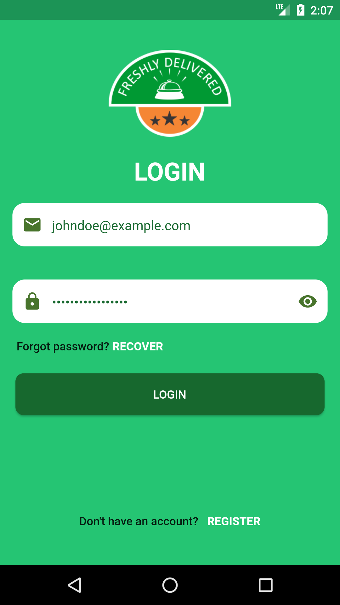
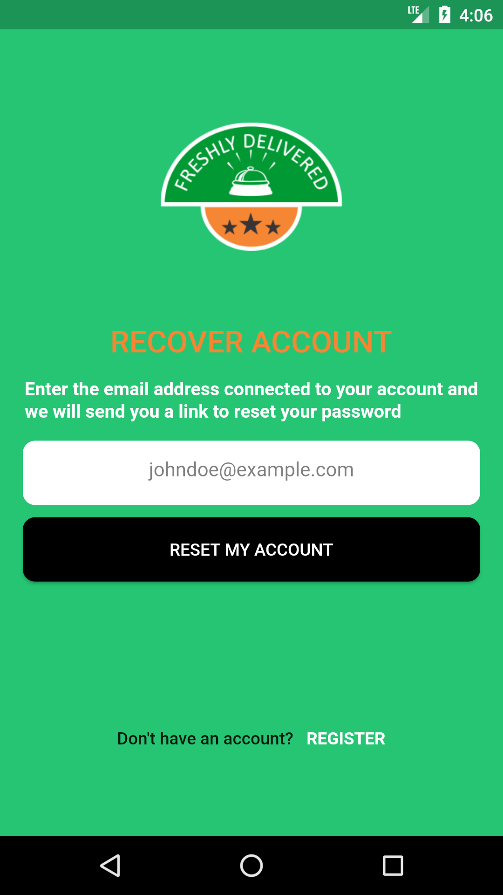
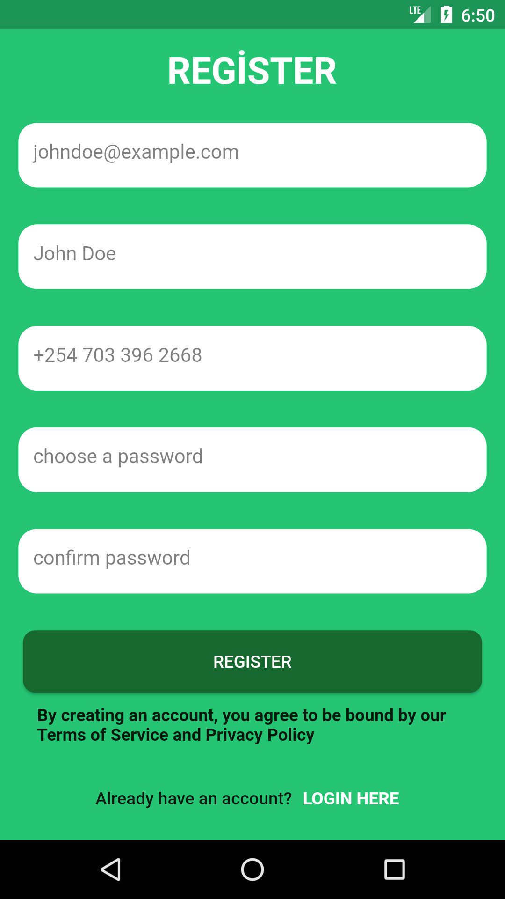

# Flutter - Freshly Delivered App

Freshly Delivered App desing I made with Flutter.

Desing : https://www.figma.com/file/EA3SmT1o15SMtMY4i5RFvN/Freshly-Delivered-App-Community

## Run Locally

Clone the project

```bash
  git clone https://github.com/yagizdo/Freshly-Delivered-App
```

Go to the project directory

```bash
  cd Freshly-Delivered-App
```

Install dependencies

```bash
  flutter pub get
```

Run App

```bash
  flutter run
```


## What will be add :question:

- [x] Splash Screen
- [ ] Onboarding Screen
- [x] Login Screen
- [x] Register Screen
- [ ] Register Screen Successful
- [x] Recover Account Screen
- [ ] Dashboard Screen
- [ ] Wishlist Screen
- [ ] Cart Screen
- [ ] Checkout address Screen
- [ ] Checkout card Screen
- [ ] Checkout final Screen
- [ ] Checkout processing Screen
- [ ] Checkout success Screen
- [ ] Settings Screen


##  Libraries I use in the application:
- Hex Color : https://pub.dev/packages/hexcolor
- Animated Splash Screen : https://pub.dev/packages/animated_splash_screen


## Screenshots
### Login


### Recover


### Register


## Contributing

Contributions are always welcome!
